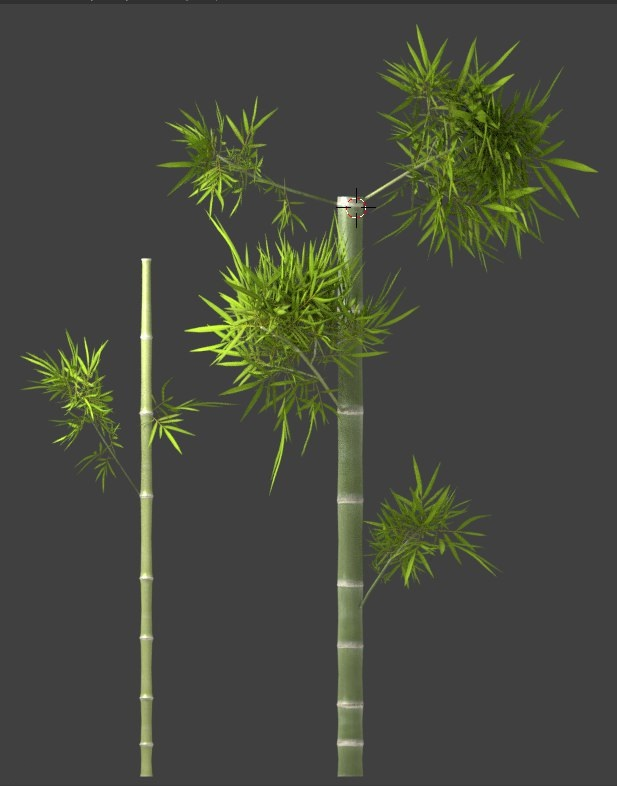

# Informatica Grafica (Computer Graphics)
This repository contains the source code and the _.blend_ models for the school project due for the _Computer Graphics_ class at Politecnico di Torino.

The project required the development of a game in C++ and OpenGL and a rendering of a scene in Blender, from modeling to texturing to lighting.

## Project description
Both the game and the rendering are set in China.

### Game
The game is an endless runner where _Long_, the Chinese dragon, has to fly over the Great Wall trying to collect coins and _ying-yang_ medals while avoiding obstacles.  
It is written in C++ and OpenGL. The models are managed with the Assimp library and textured with DevIL.

In order to have an endless runner, the Great Wall is made of pre-built blocks that are dynamically concatenated at runtime and are shifted below the dragon, which actually does not move. Each block is described by a configuration file containing the coordinates of each element (coin, _ying-yang_ medal, lantern, flag, tower, etc) that has to be positioned on or over the wall.
As soon as a block has been used, i.e. it goes out of the screen, it is destroyed in order not to waste memory.

The dragon's body is made of spheres between the head and the tail, each representing a health point. Every time the dragon collides with an obstacle, a sphere is lost and the body becomes shorter. Once the dragon hits another obstacle having only its head and tail left, the game is over.  
In order to avoid having an extremely long dragon, the speed of the game increases in order to reach a high level of difficulty and increase the chances of losing health points.

|  
:-------------------------:|:-------------------------:
Main Menu           |  Game level

  
_Long_ looses health points

#### Keys and instructions
* <kbd>↑</kbd> and <kbd>↓</kbd> for moving _Long_ up and down
* Collect coins for earning score points
* Collect _ying-yang_ medals for earning health points

### Rendering
The rendering is inspired by a scene of [Po's Dad's restaurant](https://vignette.wikia.nocookie.net/kungfupanda/images/4/4f/Kungfu-disneyscreencaps.com-1044.jpg/revision/latest?cb=20150407183429&format=original) in Kung Fu Panda. As a requirement, the scene had to contain Cycles materials, particle systems (bamboo branches and panda's fur), fluids (water), cloths (flag on the bench) and armatures (panda's bones).

|  
:-------------------------:|:-------------------------:
Bamboo particles           |  Detail for the panda

#### Final rendering scene

